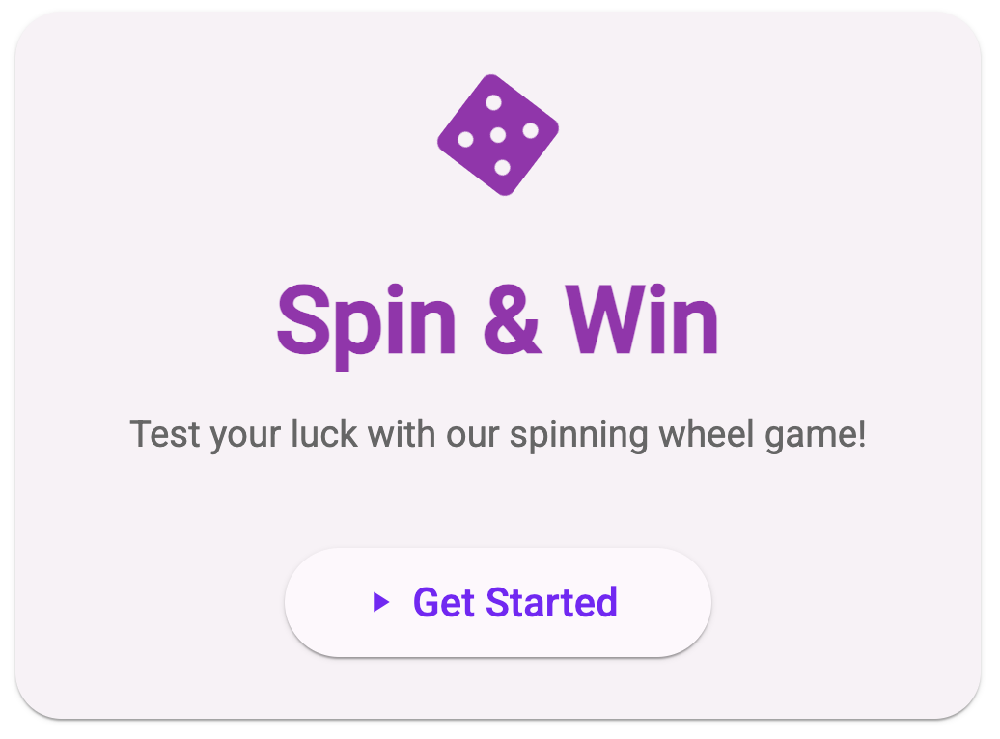

# Spin & Win - Wheel of Fortune Game



## Overview
A modern, interactive wheel of fortune game built with Angular and Angular Material. Test your luck with the spinning wheel and win exciting prizes!

## Features

### Interactive Wheel
- Smooth spinning animation
- 8 colorful segments with unique prizes
- Visual pointer indicating the winning segment


### Game Modes
#### Random Spin
- Spin the wheel for a chance to win any prize
- Completely randomised outcome

#### Predetermined Spin
- Always lands on a specific segment (Segment #3)

### Results Screen
- Animated celebration when you win
- Displays your prize with a trophy icon
- Option to play again or return to the game


### Modern UI/UX
- Clean, responsive design using Angular Material
- Smooth animations and transitions
- Mobile-friendly interface
- Loading indicators during spin

### Game Flow
1. Start at the welcome screen
2. Choose your spin mode
3. Watch the wheel spin
4. View your prize on the results screen
5. Play again or return to the welcome screen

## Technical Details
- Uses RxJS for state management
- Responsive design with SCSS
- Modular component architecture
- Type-safe with TypeScript

This project was generated using [Angular CLI](https://github.com/angular/angular-cli) version `20.0.4`. Node version must be `20.19.0` or higher.

## Development server

To start a local development server, run:

```bash
ng serve
```

Once the server is running, open your browser and navigate to `http://localhost:4200/`. The application will automatically reload whenever you modify any of the source files.

## Building

To build the project run:

```bash
ng build
```

This will compile your project and store the build artifacts in the `dist/` directory.

## Running unit tests

To execute unit tests with the [Karma](https://karma-runner.github.io) test runner, use the following command:

```bash
ng test
```
## Additional Resources

For more information on using the Angular CLI, including detailed command references, visit the [Angular CLI Overview and Command Reference](https://angular.dev/tools/cli) page.
